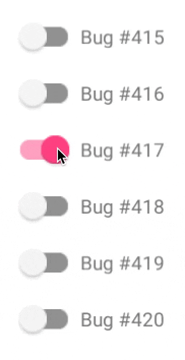

### Hi there 👋

  - 🌱 I’m currently Fresher who is persuing BE in Information Technology ⚙  
  - 🔭 I’m currently working on developing my skills for developing app's using flutter 🎯📱 
  - 📫 How to reach me:
  <ul>
    <li> <a href="https://www.linkedin.com/in/pruthvi-sooni/"> Linkedin<a/></li> 
    <li> <a href="https://twitter.com/PruthviSooni"> Twitter <a/></li> 
  </ul>

      
 
<!--
**PruthviSooni/PruthviSooni** is a ✨ _special_ ✨ repository because its `README.md` (this file) appears on your GitHub profile.

Here are some ideas to get you started:

- 🔭 I’m currently working on

 ...
- 🌱 I’m currently learning ...
- 👯 I’m looking to collaborate on ...
- 🤔 I’m looking for help with ...
- 💬 Ask me about ...
 ...
- 😄 Pronouns: ...
- ⚡ Fun fact: ...
!-->

